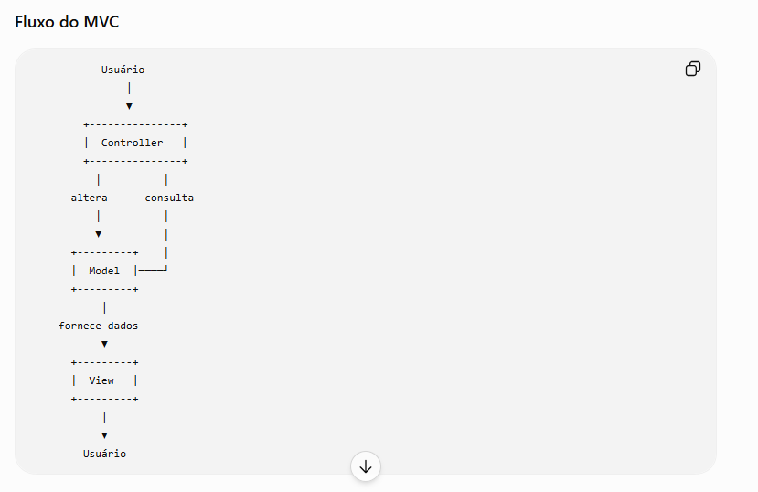

# Pesquisa e Ordenação (Continuação da Estrutura de dados) - aula 3.
# 03/08/2026

### Padrão arquitetural:

- Model:
    - Representa os dados e as regras de negócio.

- View:
    - Exibe as informações ao usuário.
    - CRUD fica dentro do VIEW.

- Controller:
    - Recebe as ações do usuário e faz a comunicação entre o Model e a View.

- Vantagens do MVC em Java:
    - Organização do código em camadas.
    - Separação entre interface, lógica e dados.
    - Facilidade de manutenção.
    - Reutilização de componentes.
    - Melhor suporte a testes.
    - Ideal para aplicações desktop (Swing/JavaFX) e web (Spring MVC, Jakarta EE).

### Comentários

- eficiente versus eficaz
    - ambos atingem objetivos
    - só que eficaz tem relação com tempo

- qual o melhor algoritmo de ordenação?
    - Depende:
        - do tamanho da estrutura
        - do quanto já está ordenado

- Cenários de um processo de ordenação:
    - pior caso
        - bolha - lista ordenada decrescente e se desejar ordenar crescente
        - seleção - lista ordenada
        - inserção - lista ordenada decrescente e se desejar ordenar crescente

## Atividade de fixação
    1) pesquisar na literatura, internet ou IA Generativa sobre os métodos de ordenação e categoriza-los em:
        - algoritmo de memória interna ou memória externa
        - estabilidade (estável ou instável)
        - complexidade
        - porções de ordenação